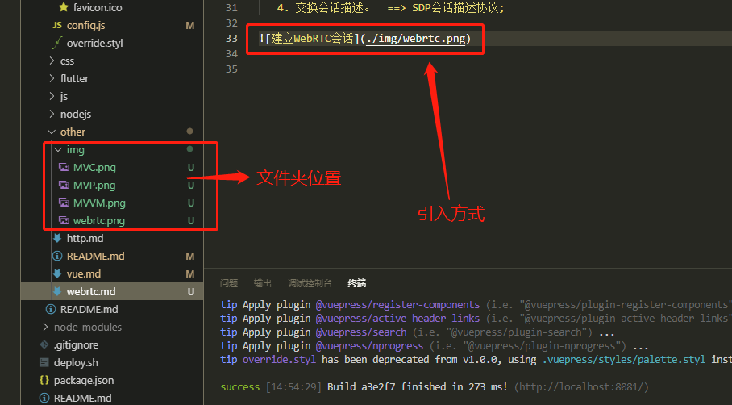

# 一些小东西

 首先说说自己搭建vuepress踩到的一些坑吧。

 基本的教程随便一搜都会有 所以 这儿说几个细节就可以。

  1. github.io库的前边的username必须是你的用户名，否则，每次发布都会出错。
  2. vue-press的库Source必须选择第二个选项 master branch/docs folder
  3. vue-press github.io的库必须对应两个源 第二个库对应的远程（或者线上的仓库）是dist文件夹。
  4. favicon刚开始设置的时候，可能会不显示，怎么刷新都没用，重启服务也没有用。正确的做法就是静置一天，第二天刷新自己就好了。
  5. 添加本地图片时的路径问题:  
     同级目录下新建文件夹img，将需要添加的图片copy到文件夹之中，！！！注意：图片的命名不能出现汉字否则编译不通过（亲测），引入方式如下：  
     ```
     
     ```


 为了防止自己又忘了，blog再次长草，发布流程做以下记录：

```
vue-press 下 bash：
git status
git add .
git commit -m'change'
git push origin master
git push -f git@github.com:kongliya/kl.github.io.git master

进入docs/.vuepress/dist:
（此时如果没有dist文件夹，执行npm run docs:build即可） 
npm run deploy

```

因为本人换了台电脑，所以done下来以后再发布的时候碰到了某些问题记录：
首先：ssh需要重新生成并且添加
```
ls -al ~/.ssh
ssh-keygen -t rsa -C 'kongliya'
cat ~/.ssh/id_rsa.pub
git push -f git@github.com:kongliya/kl.github.io.git master
```

重新push即可。
push成功后，执行如下：
```
npm run docs:build
```

重新编译，编译完成后生成dist文件夹，进入
```
npm run deploy
```
重新发布即可。