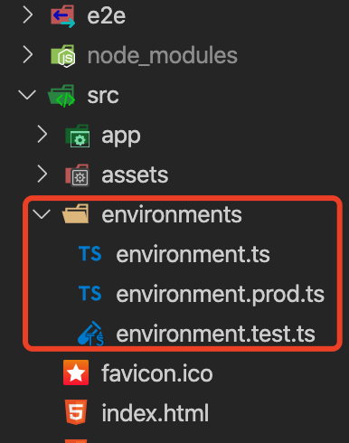

# angular4配置环境变量

因为公司有个项目要做自动化构建，方便起见，优化了下环境配置。 所以记录如下：  

angular4中配置文件名为.angular-cli.json  

```
"environmentSource": "environments/environment.ts",  // 默认环境文件;
    "environments": {
    "dev": "environments/environment.ts",  // 开发环境配置文件;
    "prod": "environments/environment.prod.ts",  // 生产环境配置文件;
    "test": "environments/environment.test.ts"   // 测试环境配置文件;
}
```

目录结构大概是在这里：  



environment.ts
```
// 开发环境;
export const environment = {
  production: false,
  变量名1: 'http://**********',  // 对应地址; 因为我们项目中可能引用的并不只有一个地址;
  变量名2: 'http://**********',  // .......
  isPass: true,  // 定义变量; (我理解的是可以定义如上的这种变量,心血来潮改为false以及注释掉发现都没影响....==。)
};
```

生产环境以及测试环境配置均如上类似。  

配置后我以为就完了，serve的时候发现地址没引用过来，感谢头儿的提醒说引用一下。  

```
// 资源文件中引用;
import { environment} from '../../environments/environment';

export const ResourceStatic = {
  '代码中引用的环境变量名1': environment.变量名1,
  '代码中引用的环境变量名2': environment.变量名2,
  ......
}
```
   
本地起服务测试：  
```
ng serve --env=prod/test/dev    // 运行分别的环境配置即可 名字为.angular-cli.json中起的变量名;
ng serve --environment=prod/test/dev    // 等同于上边的写法;

ng build --env=prod/test/dev
ng build --environment=prod/test/dev    // build类似;

```