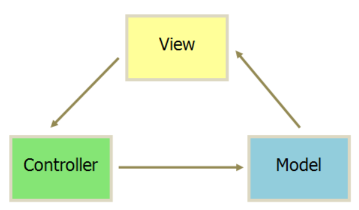
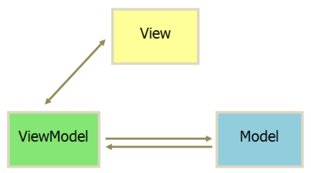

# Vue面试题总结

 迫于生计，总结一波vue的面试题。（纯属自己手动为了方便总结）

### 1. 三大框架（react/angular/vue）对比？

react：描述的是单向数据流，API简单，但是编程起来模式比较复杂；

angular：是一种强类型的编程语言，学习曲线比较陡峭；

vue：适合入门，但是也有一些高级的东西在里边。

|          | Angular  | React     | Vue      |
| -------- | -------- | --------- | -------- |
| 组织方式 | MVC      | 模块化    | 模块化   |
| 数据绑定 | 双向绑定 | 单向绑定  | 双向绑定 |
| 模板能力 | 强大     | 自由(JSX) | 自由     |
| 自由度   | 较小     | 大        | 较大     |
| 路由     | 静态路由 | 动态路由  | 动态路由 |

### 2. 虚拟DOM?

 就是将DOM操作成一个对象，把对象拿出来做处理，不直接操作DOM，极大地提升DOM性能，将多次DOM操作最后变成一次DOM操作。

 步骤：

 1)  根据现有的模板创建DOM树

 2）进行初始化渲染（循环遍历发生一次DOM操作）变成HTML

 3）数据发生变化，生成新的DOM树

 4）根据上一次虚拟DOM结构树结合数据的变化生成一个新的虚拟DOM结果

 5）将此次的虚拟DOM结构进行比对（diff算法）将不一样的地方重新渲染

### 3. vue之中如何实现MVVM？

 底层原理：双向数据绑定；

 1）首先是MVVM之中存在的一种特质，这种特质的实现是VM层和view层去进行通信而产生的；依赖于ES5的方法Object.defineProperty()；根据Object.defineProperty()监听对象中的某一个属性，一旦属性翻遍了，那么我们的set和get也会做出相应改变；

 2）观察者模式：view和model互为订阅者，一旦data之中的数据发生改变，发布给所有订阅过的view，如果一旦view里的数据改变的时候，他也会直接发布给data里的数据；

 3）data之中多了set、get和observer都是Object.defineProperty()加上去的。

### 4. MVC MVP MVVM对比？

MVC:



 1. view传送指令到 controller

 2. controller完成业务逻辑之后要求model改变状态

 3. model将新的数据发送到view，用户得到反馈

    这个时候所有的通信都是单向的。

MVP:


1. 各部分之间的通信都是双向的；
2. view和model层不发生联系，都通过Presenter传递（好比相亲，男女不见面，都通过媒婆传递）；
3. view层非常薄，不部署任何业务逻辑，而相反Presenter层非常厚，所有的业务逻辑都部署在那里。

MVVM：



1. 双向数据绑定；
2. 单线双箭头：表示一个数据发生改变，那么另一个数据无条件进行改变；
3. 双线双向箭头：表示一个数据发生改变时，通知另一个数据进行改变。（需要手动操作才能改变更新数据）

### 5. 为什么vue组件中的data是一个函数？

当组件中的data写成一个函数时，每次data都是以函数的形式返回一份新的data，组件复用时，每个组件实例都可以单独维护自己的数据，做到互不干扰，而如果以对象返回的话，使得所有的组件实例共用了一份数据，一动则全都变。

### 6. 组件间传值？

1. 父传子：

   props传值，父级在props进行传值，子级组件在组件内接收再验证最后使用数据；

2. 子传父：

   引用地址传值：父级构建一个引用类型data{setter，getter，observer}，引用地址传递给子级，当子级更改，引用地址里边的数据的时候，oberser就会通知到父级数据更新；

   chain模式传值：每个实例都存在一个链，这个链是以家族关系描述的关系；$parents  $children $root通过这些链可以找到嵌套关系中的任意一个组件；

   $ref链：在模板结构上标记属性ref，在组件的$refs之中可以非常方便准确的找到所有ref链的组件；

   函数传值方式：父级组件之中，定义一个变量（用来接收变化的值）和一个函数（用来改变刚才的值），把这个函数传递给子级，让自己调用这个函数从而实现值的改变。

   on,$emit： 给子级定义一个事件，事件处理函数是可以改变父级数据的函数，在自己需要的时候，触发函数。

3. 任意组件之间的传值：

   event bus事件总线：定义一个公用的事件的载体，这个载体在任何地方都可以访问。在要改变数据的组件上绑定事件，在改变数据的组件上触发事件。

### 7. 老生常谈：生命周期。

1. beforeCreate：初始化了事件和生命周期；  

2. created：可以访问到数据还是无法获取DOM元素；  

3. beforeMount：此时虚拟DOM已构建好但是没有放入页面（此时可以判断一下当前页面的数据和更新的数据是否一致，如果一致则可以不执行某些功能）；  

4. mounted：此时虚拟DOM已放入页面，至此，初始化阶段全部结束。  

5. beforeUpdate：data被更新，触发update；  

6. updated：虚拟DOM被重新渲染；  

7. beforeDetroy：当检测到指令$destroy被调用时；  

8. destroyed：移除所有的子组件和事件监听。  

   使用场景：一般来说，我们销毁组件以后，并不会关闭掉定时器，所以可以在该声明周期中手动关掉定时器。

### 8. 路由？

1. 什么是路由？   
    
    根据不同的url展示页面或者数据；  
    
    路由分前端路由和后端路由；前端路由多用于单页面开发(SPA)，并且前端路由是不涉及服务器的，是前端利用hash或者h5的historyAPI来实现的，一般用于不同内容的展示和切换；  
    
2. 路由跳转方式？
    1. a标签跳转；  
    ```
    <a href="#/home">首页</a>
    ```
    2. router-link跳转；
    ```
    <router-link to='/home'></router-link>
    ```
    3. 编程式路由；
    ```
    this.$router.push()  
    ```
    ​	此处说明下$route和$router区别（因为鄙人不才一直混）：当我们在vue之中打印this时会有$route和$router等相关信息；$route显示我们路由的配置与参数；而$router是路由的一个实例化对象，里边放的是方法

3. 路由传值：
    1. path路径传值；
    ```
    path:"/home/:id/name",
    接收的时候通过 this.$route.params;
    ```
    2. query传值；  

      因为在url之中?后边的参数不会被解析，因此我们可以通过query传值，接收的时候通过this.$route.query;   

    3. 路由解耦；
      在配置路由的时候添加props属性为true，在需要接受参数的组件页面通过props进行接受；  

    4. 编程式导航；
    ```
    this.$router.push({path:"/home",query:{}});
    ```

4. 路由配置项常用的属性以及作用；  

    路由配置参数：  

    path: 跳转路径；  

    component：路径相对于的组件；  

    name：命名路由；  

    children：子路由的配置参数（路由嵌套）；  

    props：路由解耦；  

    redirect：重定向路由；  

5. 如何检测路由参数的变化？  

    通过属性监听来实现或者beforeRouterUpdate();

    ```
    watch:{
        "$router"(){
    
        }
    }
    beforeRouterUpdate(to,from,next);
    ```

6. 路由守卫？  

    路由跳转前后做的一些验证；  

    路由常见的钩子函数：beforeRouteEnter、beforeRouteUpdate、beforeRouteLeave  

    beforeRouteEnter: 在渲染该组件的对应路由被confirm前调用，不能或者组件实例this（因为守卫执行前，组件实例还没被创建）；  

    beforeRouteUpdate：当前路由改变，但是该组件复用时调用，可以访问组件实例this；  

    beforeRouteLeave：导航离开该组件的对应路由时调用，可以访问组件实例this；（场景：用户没有支付离开时、用户填完信息没有保存时候等等）  

    全局守卫：router.beforeEach();
    ```
    const router = new VueRouter({.....})
    router.beforeEach((to,from,next)=>{
        .......
    })
    参数to：到哪里去；
    参数from：从哪里来；
    参数next：Fuction; 一定要调用该方法来resolve这个钩子；
    ```
    全局后置钩子：router.afterEach();  

    和守卫的区别是：这些钩子不会接受next函数也不会改变导航本身。

### 9. Vuex

想放个图，就是很经典的那个图，一看就懂的那个 但是 路径问题怎么搞还是不知道，So.....先文字描述吧；  

首先：Vuex是状态管理器；

其次，为什么用？  

===>  

vue是单向数据流；

1. 当我们处理大量数据时，传参的方法对于多层嵌套来说是非常繁琐的，而且兄弟间的状态传递是无能为力的；

2. 我们经常会采用父子组件直接引用或者通过事件来变更和同步状态的多份拷贝；

   而以上模式都非常脆弱，会造成无法维护的代码。

   所以，我们将组件的共享状态拿出来以一个全局单例模式管理。

再次，有哪些东西？

1. state：数据源存放地，对应于一般vue对象里的data；存放公共的状态；
2. getter：相当于计算属性，所以，getter的返回值会根据它的依赖被缓存起来，且只有当他的依赖值发生改变了才会被重新计算；
3. mutation：只是用来修改数据的，数据的修改必须通过mutation；俩参数：state，params；
4. action：大多数时候用来处理异步操作；
5. module：有时候我们应用的所有状态可能会集中到一个比较大的对象。当应用复杂时，store会很臃肿，所以我们将store分割成模块，就像我们在文件夹之中建立子文件夹B一样，目的都是方便管理。

数据传递过程：  

当组件进行数据修改的时候我们需要调用Dispatch来触发actions里边的方法，actions里的每个方法都有一个commit方法，当方法执行的时候，通过commit来触发mutation里边的方法进行数据修改，mutation里都每个函数都有一个state参数，进行数据修改，数据修改完毕以后，会渲染到页面，页面的数据也会发生改变。

### 10. axios和jquery的ajax区别？

1. axios的优点：

   从nodejs之中创建http请求；  

   支持promiseAPI；  

   提供了一些并发请求的接口；  

   自动转换json数据；  

   客户端支持防止CSRF/XSRF攻击；  

2. ajax的缺点：

   jquery一整个库因为单纯想用ajax就引入项目不合理；  

   基于原生的XHR开发，但是 XHR 架构并不清晰；

